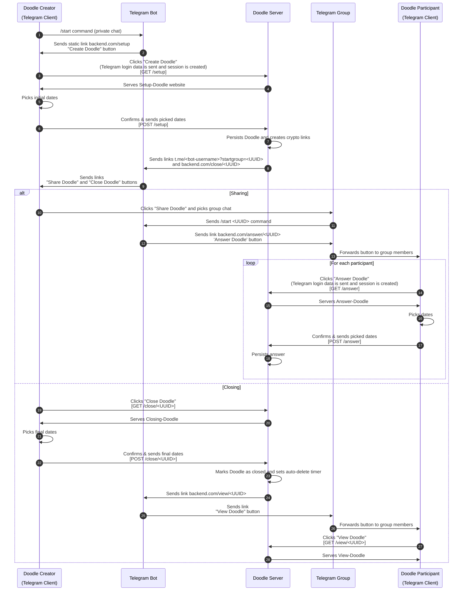

# [](https://github.com/torond/toodlebot) ToodleBot
Telegram bot for scheduling meetings and events directly from Telegram.  
Works best on smartphones.  
To use this bot, message [@thetoodlebot](https://t.me/thetoodlebot) to get started!

## Deployment Setup
Follow these steps to deploy an instance of ToodleBot to a Uberspace.

1. Go to [uberspace.de](https://www.uberspace.de) and register for a new space.
2. Add an SSH key under Logins in the dashboard.
3. (Optional) Add a custom domain:
   ```bash
   ssh <username>@<hostname> "uberspace web domain add isabell.example"```
3.1 (Optional) Update the DNS records with the IP adresses given from the previous command.
4. Create a Telegram bot with BotFather and set its domain to the Uberspace domain or your custom domain.
5. Configure the backend:
   ```bash
   ssh <username>@<hostname> "uberspace web backend set <your-domain> --http --port 8088"```
6. Get the executable (or run `./gradlew build` to obtain the `.jar` and copy that over to the server):
   ```bash
   ssh <username>@<hostname> "wget https://github.com/torond/toodlebot/releases/download/0.1.2/toodlebot-0.1.2.jar"```
7. Add config file:
   ```bash
   ssh <username>@<hostname> "echo \"domain=<domain of server>                        
   port=8088
   bot_username=<name of the Telegram bot without @>
   bot_token=<token of the Telegram bot>\" > environment.properties"```
8. Create data folder in home directory (todo: should be done by app itself):
   ```bash
   ssh <username>@<hostname> "mkdir data"```
9. Add `supervisord` script and run the app:
   ```bash
   ssh toodle@grus.uberspace.de "echo \"[program:toodlebot]
   command=java -jar ~/toodlebot-0.1.0.jar
   startsecs=20
   autostart=false\" > ~/etc/services.d/toodlebot.ini
   supervisorctl reread
   supervisorctl update
   supervisorctl start toodlebot"```
The bot should now respond to `/start` and you should be able to create Toodles.


## Development Setup
Follow these steps if you want to set up an instance for yourself.
Create a file `environment.properties` to the repository root with the following contents:
```
domain=<Local ip address of the machine the application is running on e.g. http://123.456.789.000>
port=<port the app should run on e.g. 8088>
bot_username=<Name of the Telegram bot (without @) e.g. thetoodlebot>
bot_token=<Token of the Telegram bot>
```

Use `/setdomain` in BotFather to enable Login URL.
For development purposes, this should be the same as the ip in `host` above (e.g. `123.456.789.000`).

For more information on the data flow between users, server and bot see the [Data Flow](#data-flow) section.

## Contributing
After V1.1 this project will probably go into maintenance-only mode.  
If you want to contribute or have any questions, hit me up on [Twitter](https://twitter.com/dcreinartz) :)

Some guidelines (subject to change):
- Follow the principle of least astonishment.
For `DataBaseService`:  
- Mention parameters (e.g. `byDoodleId`) in method names, but not in add methods
- Mention IDs always with corresponding Table (`doodleId` instead of `uuid`)
- No `EntityId<...>` or other IDs in Server.kt, except doodleId

## Data Flow
A more detailed look at how this app works internally.

### Components
- A **Doodle Creator** acts as a Doodles admin. Note that a Doodles creator can also participate in it. There can only be one admin per Doodle.
- The **Telegram Bot** is the mediator between Client, Doodle Server and Group Chat. It does not contain any logic for the Doodle as this is the backends task.  
- The **Doodle Server** contains business logic. It generates Doodle pages and manages user data. 
- A **Telegram Group** is the place where a created Doodle is shared. Note that Doodles can be shared to more than one group.
- A **Doodle Participant** can answer given Doodles. Obviously there can be many participants.

### Notes / Scope
- On all endpoints users are authenticated via their (hashed) Telegram data. Only the Doodle creator is authorized to edit and close the Doodle.
- Not shown in the diagram is that as long as the Doodle is open, "Create Doodle" and "Answer Doodle" can be accessed multiple times to change the proposed dates and answers.

### Typical data flow sequence diagram
![A rendered picture of the diagram described below.](https://mermaid.ink/img/eyJjb2RlIjoic2VxdWVuY2VEaWFncmFtXG5hdXRvbnVtYmVyXG5wYXJ0aWNpcGFudCBDIGFzIERvb2RsZSBDcmVhdG9yPGJyPjxicj4oVGVsZWdyYW0gQ2xpZW50KVxucGFydGljaXBhbnQgQiBhcyBUZWxlZ3JhbSBCb3RcbnBhcnRpY2lwYW50IFcgYXMgRG9vZGxlIFNlcnZlclxucGFydGljaXBhbnQgRyBhcyBUZWxlZ3JhbSBHcm91cFxucGFydGljaXBhbnQgUCBhcyBEb29kbGUgUGFydGljaXBhbnQ8YnI-PGJyPihUZWxlZ3JhbSBDbGllbnQpXG5cbkMgLT4-IEI6IC9zdGFydCBjb21tYW5kIChwcml2YXRlIGNoYXQpXG5CIC0-PiBDOiBTZW5kcyBzdGF0aWMgbGluayBiYWNrZW5kLmNvbS9zZXR1cDxicj5cIkNyZWF0ZSBEb29kbGVcIiBidXR0b25cbkMgLT4-IFc6IENsaWNrcyBcIkNyZWF0ZSBEb29kbGVcIjxicj4oVGVsZWdyYW0gbG9naW4gZGF0YSBpcyBzZW50IGFuZCBzZXNzaW9uIGlzIGNyZWF0ZWQpPGJyPltHRVQgL3NldHVwXVxuVyAtPj4gQzogU2VydmVzIFNldHVwLURvb2RsZSB3ZWJzaXRlXG5DIC0-PiBDOiBQaWNrcyBpbml0aWFsIGRhdGVzXG5DIC0-PiBXOiBDb25maXJtcyAmIHNlbmRzIHBpY2tlZCBkYXRlczxicj5bUE9TVCAvc2V0dXBdXG5XIC0-PiBXOiBQZXJzaXN0cyBEb29kbGUgYW5kIGNyZWF0ZXMgY3J5cHRvIGxpbmtzXG5XIC0-PiBCOiBTZW5kcyBsaW5rcyB0Lm1lLzxib3QtdXNlcm5hbWU-P3N0YXJ0Z3JvdXA9PFVVSUQ-PGJyPiBhbmQgYmFja2VuZC5jb20vY2xvc2UvPFVVSUQ-XG5CIC0-PiBDOiBTZW5kcyBsaW5rczxicj5cIlNoYXJlIERvb2RsZVwiIGFuZCBcIkNsb3NlIERvb2RsZVwiIGJ1dHRvbnNcbmFsdCBTaGFyaW5nXG5DIC0-PiBHOiBDbGlja3MgXCJTaGFyZSBEb29kbGVcIiBhbmQgcGlja3MgZ3JvdXAgY2hhdFxuRyAtPj4gQjogU2VuZHMgL3N0YXJ0IDxVVUlEPiBjb21tYW5kXG5CIC0-PiBHOiBTZW5kcyBsaW5rIGJhY2tlbmQuY29tL2Fuc3dlci88VVVJRD48YnI-J0Fuc3dlciBEb29kbGUnIGJ1dHRvblxuRyAtPj4gUDogRm9yd2FyZHMgYnV0dG9uIHRvIGdyb3VwIG1lbWJlcnNcbmxvb3AgRm9yIGVhY2ggcGFydGljaXBhbnRcblAgLT4-IFc6IENsaWNrcyBcIkFuc3dlciBEb29kbGVcIjxicj4oVGVsZWdyYW0gbG9naW4gZGF0YSBpcyBzZW50IGFuZCBzZXNzaW9uIGlzIGNyZWF0ZWQpPGJyPltHRVQgL2Fuc3dlcl1cblcgLT4-IFA6IFNlcnZlcnMgQW5zd2VyLURvb2RsZVxuUCAtPj4gUDogUGlja3MgZGF0ZXNcblAgLT4-IFc6IENvbmZpcm1zICYgc2VuZHMgcGlja2VkIGRhdGVzPGJyPltQT1NUIC9hbnN3ZXJdXG5XIC0-PiBXOiBQZXJzaXN0cyBhbnN3ZXJcbmVuZFxuZWxzZSBDbG9zaW5nXG5DIC0-PiBXOiBDbGlja3MgXCJDbG9zZSBEb29kbGVcIjxicj5bR0VUIC9jbG9zZS88VVVJRD5dXG5XIC0-PiBDOiBTZXJ2ZXMgQ2xvc2luZy1Eb29kbGVcbkMgLT4-IEM6IFBpY2tzIGZpbmFsIGRhdGVzXG5DIC0-PiBXOiBDb25maXJtcyAmIHNlbmRzIGZpbmFsIGRhdGVzPGJyPltQT1NUIC9jbG9zZS88VVVJRD5dXG5XIC0-PiBXOiBNYXJrcyBEb29kbGUgYXMgY2xvc2VkIGFuZCBzZXRzIGF1dG8tZGVsZXRlIHRpbWVyXG5XIC0-PiBCOiBTZW5kcyBsaW5rIGJhY2tlbmQuY29tL3ZpZXcvPFVVSUQ-XG5CIC0-PiBHOiBTZW5kcyBsaW5rPGJyPlwiVmlldyBEb29kbGVcIiBidXR0b25cbkcgLT4-IFA6IEZvcndhcmRzIGJ1dHRvbiB0byBncm91cCBtZW1iZXJzXG5QIC0-PiBXOiBDbGlja3MgXCJWaWV3IERvb2RsZVwiPGJyPltHRVQgL3ZpZXcvPFVVSUQ-XVxuVyAtPj4gUDogU2VydmVzIFZpZXctRG9vZGxlXG5lbmQiLCJtZXJtYWlkIjp7fSwidXBkYXRlRWRpdG9yIjpmYWxzZX0)

Diagram code:

