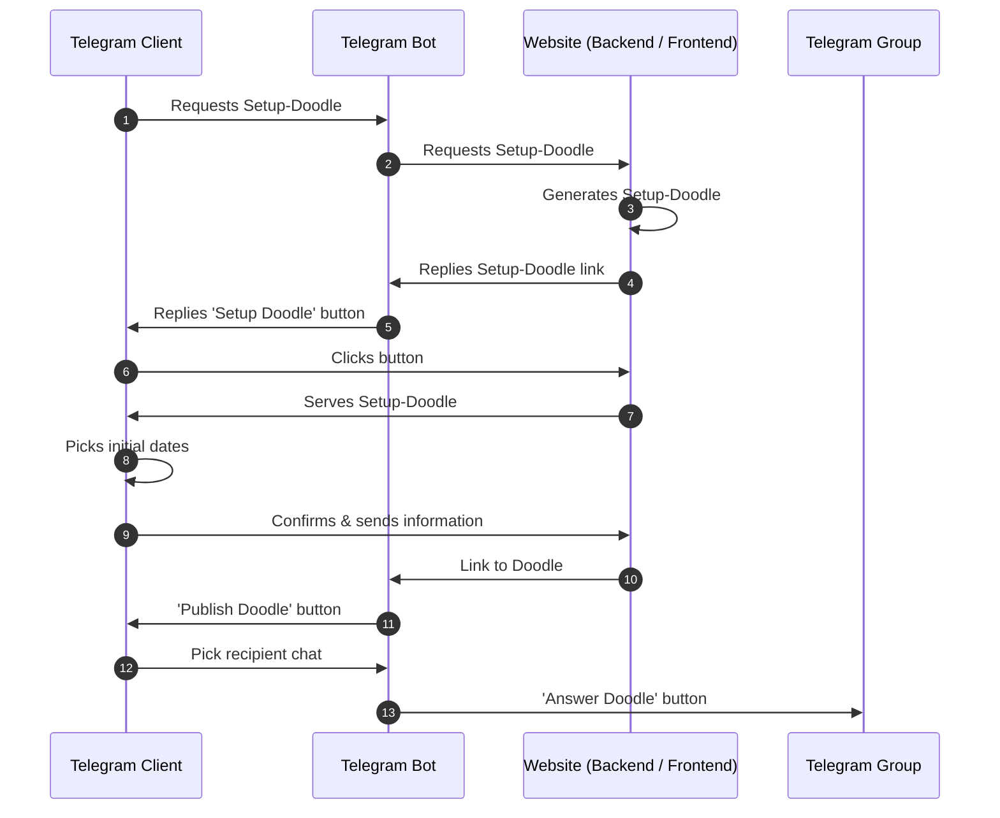

# Data Flow

## Notes / Scope
- One creator choosing initial dates, many participants picking from those dates
- Creation happens in a private chat with the bot
- Time-Out for Doodles might be useful

## Components
- The **Telegram Bot** serves as the mediator between Client, Website and Group Chat. It does not contain any logic for the Doodle as this is the backends task.  
- The **Backend** generates Doodles and manages user data. 
- The **Frontend** acts as a GUI for answering to the Doodle and runs in the in-app browser.

## Creating a Doodle
A Doodle is created in a private chat with the bot. After the setup process it can be published to e.g. a group chat.

## Answering a Doodle

## Concluding a Doodle
Creator has the extra button `Close Doodle` below the `Answer Doodle` button. Following this button he can pick final dates and close the Doodle. The inline bot updates its message with the final dates, removes all buttons and sends a sticky notification to the chat to alert users. The website deletes the Doodle.