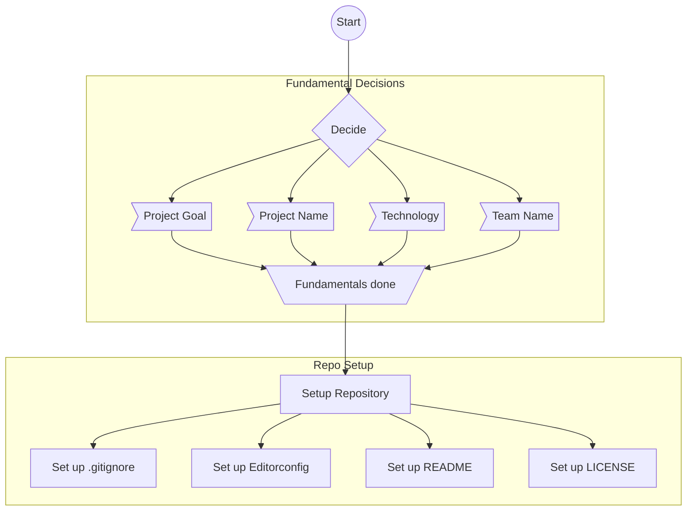

# Workflow for Software Projects

## Todos

### Fundamentals

- Decide on project goal
- Decide on project name
- Decide on the technology
- Decide on team name
- Decide on workflow

### Setup

- Add Repo
- Add .gitignore
- Add Editorconfig

### Graph Legend

- Circles: Start and Stop of compelete graph
- Boxes: Do
- Down Trapezoid: End of graph/Section
- Flag: Topic of Discussion, requires documentation on done
- Rhombus: Questions/Decision

