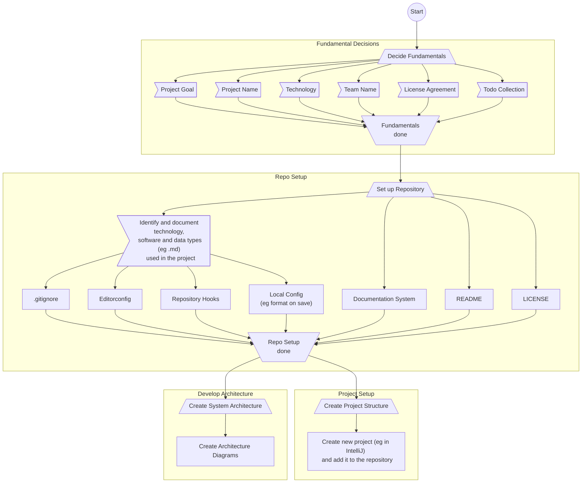

# Workflow for Software Projects

## Graph Legend

- Circles: Start and Stop of compelete graph
- Boxes: Do
- Up Trapezoid: Start of graph section
- Down Trapezoid: End of graph section
- Flag: Topic of Discussion, requires documentation on done
- Rhombus: Questions/Decision

